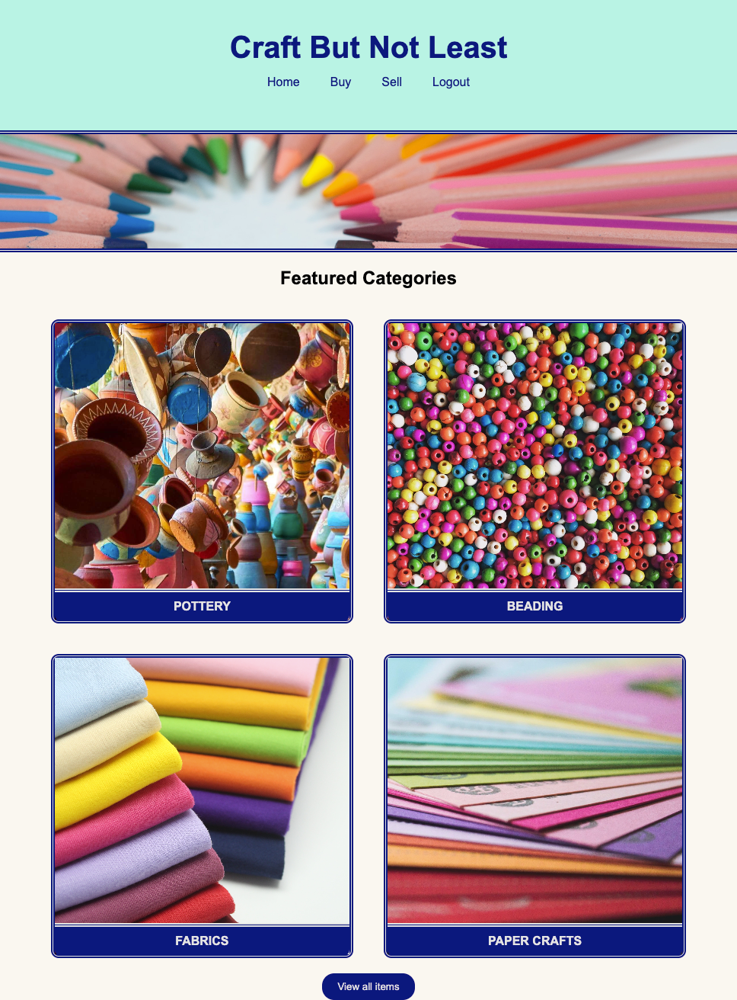

​
# Craft But Not Least

​[](https://choosealicense.com/licenses/mit/)


​
## Description

[Craft But Not Least](https://craft-but-not-least.herokuapp.com/) is a full-stack web application that allows users to create an account, login, create listings for and purchase or trade craft supplies and tools directly from other users.
​

Many individuals in the Maker community have collected spare supplies that they no longer use. Likewise, for Makers who are interesting in purchasing supplies secondhand, it can be challenging to find what they are looking for. We were motivated to create this application to fill a need in the Maker community.  A platform for Makers to connect with each other to buy, sell or trade their secondhand craft supplies and tools. A place for Makers to support, and supply, each other! 




## Table of Contents
- [Technologies](#technologies)
- [Installation](#installation)
- ​[Usage](#usage)
- [License](#license)
- [Credits](#credits)
- [References](#references)
- [Future Development](#directions-for-future-development)
- [Contact](#contact)


## Technologies 
​
**Runtime:** Node.js
​
**Lanuage:** Javascript
​
**Dependencies:** 
​
- "bcrypt": "^5.0.0",
- "connect-session-sequelize": "^7.0.4",
- "dotenv": "^8.2.0",
- "express": "^4.17.1",
- "express-handlebars": "^5.2.0",
- "express-session": "^1.17.1",
- "multer": "^1.4.5-lts.1",
- "mysql2": "^2.2.5",
- "path": "^0.12.7",
- "sequelize": "^6.3.5"
​
​
## Installation
​
No installation necessary to use the deployed web application.

GitHub repository can be found [here](https://github.com/rbkeyes/craft-but-not-least).

For development, you must have [node.js](https://nodejs.org/en/) installed on your computer.

The package.json contains the dependencies needed to run this application. To install, run command `npm i` or `npm install` in the command line of your integrated terminal. 
​
With the package.json file, use jest to excute the tests in the terminal by the following command:
```
npm i
```
​
For npm scripts:
```
  "scripts": {
    "test": "echo \"Error: no test specified\" && exit 1",
    "start": "node server.js",
    "seed": "node seeds/seed.js"
  }
```
## Usage

Upon navigation to the application, user will be presented with the homepage. User will be prompted to log in, or sign up, before navigating to other pages of the application. After login, user is redirected to the home page.

To list an item for sale, user selects "Sell" from the navigation bar, completes form, and clicks "submit". (NOTE: Image upload feature is not complete. Current status is successful upload to disk storage in dev environment, need to explore alternative storage for deployed application. Model and relationship of image to product are not functional at this time).

To view all items for sale in the database, select "Buy" from the navigation bar in the header, or the "View all items" button at the bottom of the page (NOTE: the ability to view products by tag is not available at this time).

Select "Logout" from the nav bar to logout.
​
**Development:**

To excute MySQL shell in the terminal by the following command:
```
mysql -u root
```
or if you have a password for database try:
```
mysql -u root -p
```
then source the schema file:
```
SOURCE db/schema.sql;
```
To seed the database:
```
npm run seed
```
To run the application:
```
node server.js
```
Or 
```
npm start
```

## License

[MIT license](./LICENSE)

## Credits

This application was built in collaboration with:

- [Mengxue Xu](https://github.com/mxu4321)
    - backend routes
    - sequelize models
- [Winston Heard](https://github.com/winstonheard)
    - homepage layout
    - product listings layout
    - styling throughout
- [Marissa Thompson](https://github.com/marissa424)
    - login/logout HTML & styling
    - profile page template
    - file upload using multer package
- and myself: [Reed Keyes](https://github.com/rbkeyes)
    - repo owner and project manager
    - new-listing template, routes, and form handler
    - form handler for login/signup/logout
    - Heroku deployment

Items listed above are just examples of the effort put in by this team. 

## References

Course materials from the UC Berkeley Full-Stack Web Developer bootcamp were heavily referenced in building this application. Particularly modules 13 and 14.

Documentation for the various dependencies used in this project was extremely helpful, particularly for the multer package, which was new to us:
- [multer](https://www.npmjs.com/package/multer)
- documentation for all dependencies can be found [here](https://www.npmjs.com/) - just enter the name of the package in the search bar.

Documentation for [sequelize](https://sequelize.org/docs/v6/core-concepts/model-querying-basics/) and [handlebars](https://handlebarsjs.com/guide/) were also used.

​
## Directions for Future Development
​
- Upload and store image files for products to be displayed on product tags:
    - Currently the file uploads are not being stored in database. Need to update route and public .js to accomplish this. 
    - Create relationship between Image and Product so that Image can be displayed with the product it belongs to.
    - During dev files are storing to disk storage. We are looking into cloud storage options for deployed application but didn't have time to figure it out.
- Finish building out the UI:
    - Homepage with dynamically created category cards (currently hard-coded).
    - Product page to view more details about product listing, including option to contact seller directly.
    - User profile page where sellers can view, edit, and delete their listings, as well as their account.
    - Add photos to product cards using db data.
    - Fine-tune the styling to be clean and consistent throughout the application.

## Contact

Have questions? Contact [me](https://github.com/rbkeyes) or one of my [collaborators](#credits) on GitHub.   
Or [email me](mailto:rbkeyes@gmail.com).
